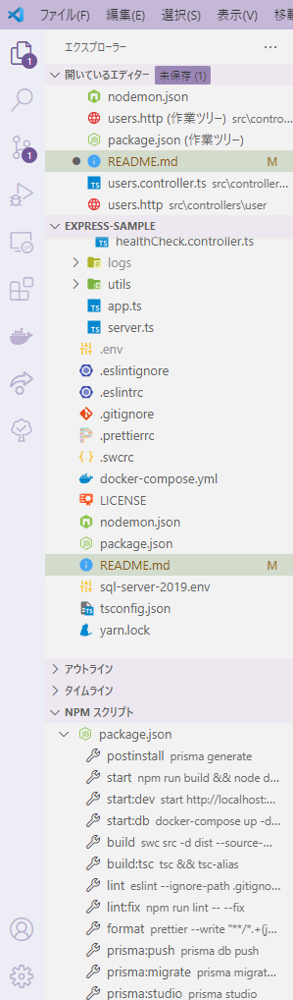
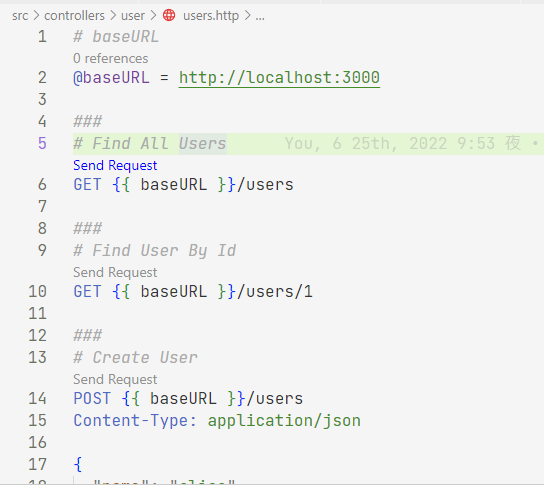

# express-sample

インターンシップ用サンプル

必要と思われるVSCodeの拡張機能は拡張機能タブのワークスペースの推奨からインストール可能

以下のものを設定している

- vscode-eslint(TypeScriptのリンター)
- rest-client(HTTPリクエストを送れるようにする拡張機能)
- prisma(prismaのDB用スキーマ言語の拡張機能)

現状DBはSQL Serverとしているが、以下のDBに対応している
- SQLite
- MySQL
- PostgreSQL
- MongoDB
- CockroachDB

以下、使い方



画像のNPMスクリプトから各種コマンドを実行可能

- ローカルでDockerを利用してDBを立ち上げる場合

1. Docker及びDocker-Composeを使えるようにする
2. npm scriptのstart:dbを実行

`npm run start:db`

- APIの起動

1. prismaを利用してDBにマイグレーションを行う

`npm run prisma:migrate`

その後マイグレーションの名前を指定する必要あり

はじめはinit等で

その後はDBのスキーマ変更理由を名前にする

2. APIを起動する

  `npm run start:dev`

  同時にブラウザが立ち上がる

3. DBを確認する

`npm run prisma:studio`

ブラウザが立ち上がり、DBの状態確認と更新を行うことができる

- APIの実行確認

VScodeの拡張機能を利用してHTTPリクエストを投げる

サンプルではusers.httpのファイルを開いてsend requestボタンを押すことで送ることが可能




- DBのスキーマ定義変更

1. prismaフォルダ内のschema.prismaファイルを変更する
2. DBにマイグレーションを行う

`npm run prisma:migrate`

変更理由を指定する

場合によってはDB内部のデータが消去されることの確認がある

DBの定義は以下を参照

[https://www.prisma.io/docs/concepts/components/prisma-schema](https://www.prisma.io/docs/concepts/components/prisma-schema)

- **model＝テーブル**と考えてよい
- ?を付ければnullable
- @id等でその他の設定を追加
- リレーションは@relation(fields: [authorId], references: [id])のようにていぎ
自テーブルのauthorIdとリレーション先テーブルのidを紐づける設定
- @unique または　@@uniqueでユニークキーの設定が可能

``` prisma

model User {
  id        Int      @id @default(autoincrement())
  createdAt DateTime @default(now())
  email     String   @unique
  name      String?
}

model Post {
  id        Int      @id @default(autoincrement())
  createdAt DateTime @default(now())
  updatedAt DateTime @updatedAt
  published Boolean  @default(false)
  title     String   @db.VarChar(255)
  author    User?    @relation(fields: [authorId], references: [id])
  authorId  Int?

  @@unique([createdAt, title])
}
```
